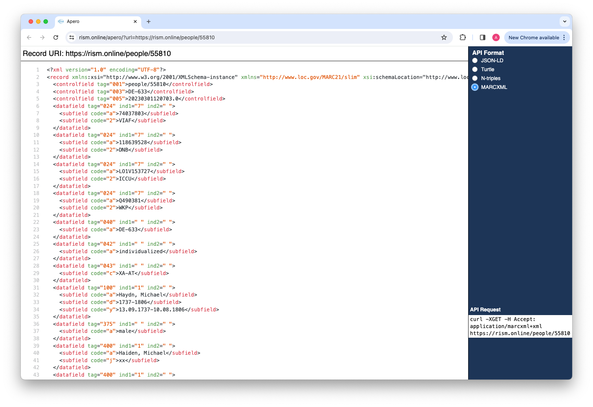

## API Viewer

One way of getting started with the RISM Online API is through the use of the API Viewer tool. On every resource page
there is a link in the footer to the API Viewer. This opens a new window where users can view the underlying data for
that resource, as well as control some of the parameters through form controls.

> Note: The API Viewer will allow you to choose both Turtle and N-Quads representations of the data. 
> These are still experimental representation of the RISM data records, and their structure and content will change, 
> probably dramatically, in the future. 

As the controls are changed, an example of how to request this representation using the command-line tool `cURL` is
shown. The parameters of this command can also be used as hints to translate this request to another tool. Since the
behaviour relies only on well-understood mechanisms in the HTTP specification, any client tool can be used to make these
requests.

