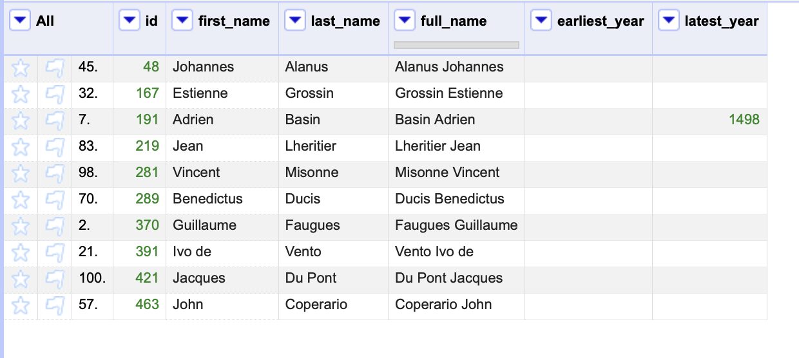
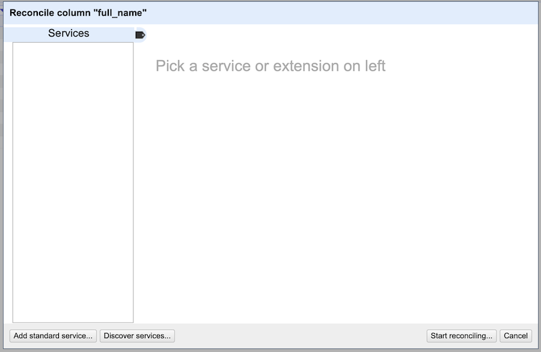
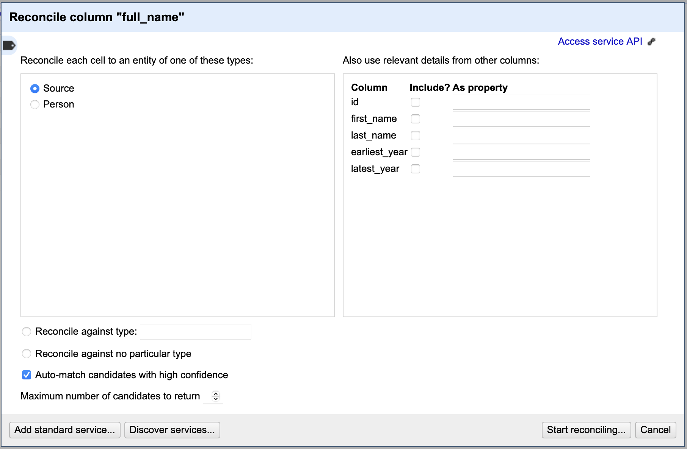
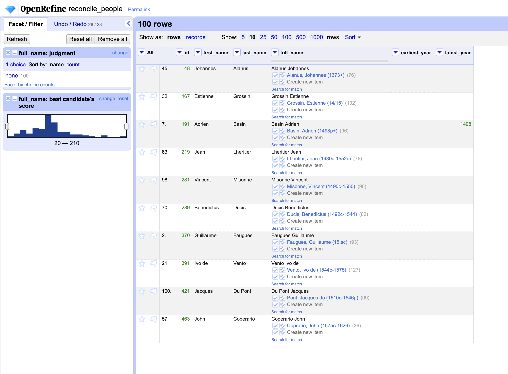
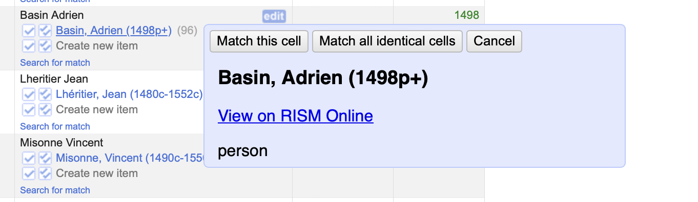

# The RISM Online Reconciliation Service

To get started you should have some data loaded into OpenRefine. This is usually data from your own project, and may come from a variety of sources. Your data should describe one of three classes of data in RISM: Sources, People, and Institutions. At least one column in your dataset should have some value that you can use to query RISM for a match. In the screenshot below there is an example where we have ten people that we wish to reconcile against RISM.

At the top of each column is a downward pointing arrow. Clicking this will reveal a number of tools for working with the data in that column. The very last option in this list is "Reconcile", which reveals a sub-menu of further actions. To get started with reconciliation, choose the "Start reconciling..." option. This will bring up a window with further options.

In the bottom left of this window you will see a button labelled "Add standard service...". You will be prompted to enter the service's URL. For RISM Online this URL is `https://rism.online/reconciliation/reconcile`. This will then show a "Working..." progress box, after which something like the following screen will be shown. (The specifics may be different depending on the type of data you are trying to reconcile).

This box is asking you to provide some guidance on how you would like to reconcile your data. From the top-left, this is asking whether you wish to reconcile the data in this column against the RISM Source records, or the Person records. For our example, we would choose "Person." The top-right area is asking whether any of your other columns contain additional data that you wish to apply as a filter; for people we have no additional data to include, so we will leave this blank.

Across the bottom you have the ability to specify a type if the specific type does not appear in the top-left, or to reconcile against all available types. For this example we will leave them blank. You can also choose to auto-match records with high confidence, or to only provide a maximum number of options to return.

When you have set the options the way you want, click the "Start reconciling" button in the bottom-right. (You can always go back and re-do this reconciliation process if you need to.) The reconcilation process will run; it may take some time to complete, depending on how much data you have.

Once the reconcilation process completes, your data should be changed to show a set of checkboxes showing possible matches to a record on RISM Online. An example of this is shown below.

Hovering over each of the options will show a small flyout which has a link to the record on RISM Online, where you can double-check whether the suggestion is correct.

If you are satisfied that the match is correct, click the checkbox after the name. The cell will change to show the new value that you have aligned.